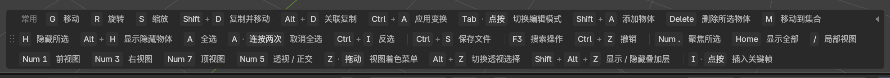
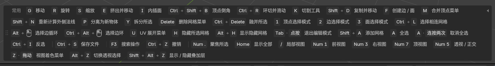
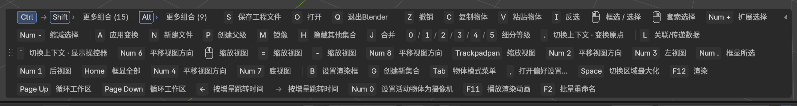
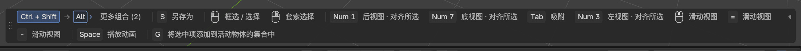
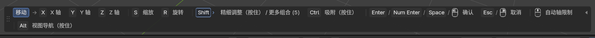

# Shortcut Compass · Blender 快捷键提示

在 Blender 编辑区域底部显示快捷键。平时查看常用操作，按住 Ctrl、Shift、Alt 后逐级查看组合，进入移动等操作后继续显示相关提示。


## 安装

1. 在 [Releases](https://github.com/syj0401/blender-shortcut-compass/releases) 下载 `shortcut_compass-0.6.0.zip`。这是 Blender 安装包；GitHub 自动生成的 Source code ZIP 是整个仓库源码。
2. 打开 Blender → 编辑 → 偏好设置 → 获取扩展 → 右上角菜单 → 从磁盘安装（Install from Disk），选择安装包并启用。
3. 在顶部「窗口」菜单选择「快捷键助手：显示悬浮提示」，或在 3D 视图按 N，打开「快捷键」侧栏。
4. 将鼠标移入需要操作的编辑区域。普通提示功能不需要 Python 环境或 MCP 连接。

扩展声明最低支持 Blender 4.2。随原始项目交付的说明记录测试环境为 Blender 5.2.0；其他版本尚未逐一实机验证，遇到问题欢迎提交 Issue，并附 Blender 版本、操作步骤及截图。

## 使用效果

### 常驻提示

不按键时也能查看 G/R/S 等常用操作。



### 网格编辑

按 Tab 切换模式，提示更新为挤出、内插、环切等操作。



### 按住 Ctrl

显示下一步可接的键；带描边的 Shift 是组合分支，数字表示分支中的组合数量。



### 继续按住 Shift

进入 Ctrl＋Shift 层，此时再按 S 就是「另存为」。松开 Shift 返回上一层。



### 移动过程中

按 G 开始移动，X/Y/Z 限制轴，Enter 确认，Esc 取消。松开 G 后提示仍保留，直到操作结束。



提示读取实际键位配置，示例以截图中的绑定为准。当前层候选按用途排列，相同功能共享说明，放不下一行时自动换行。字号可在侧栏或插件偏好设置中调整。

## 已知限制

- 空闲列表精选常用操作，并不列出全部快捷键；按住前缀后读取当前上下文的适用绑定。
- 编辑区域过小时可能容纳不下全部候选，需要扩大区域。
- 部分宏和操作内部的特殊状态无法完整反映，可同时参考 Blender 自带的底部状态栏。
- 鼠标离开 Blender 时，上下文沿用最后悬停的编辑区域。
- 自定义键位及不同编辑器下的表现仍需继续收集反馈。

## 可选 MCP 接入

`mcp_bridge/` 提供只读桥接，让支持 MCP 的客户端查询 Blender 的编辑器、模式、选择状态和快捷键提示。它不执行 Python、不模拟按键，也不修改场景。

详见 [MCP 接入说明](docs/mcp-setup.md) 和 [桥接文档](mcp_bridge/README.md)。需要外部 Python 3.10 或以上版本，依赖固定在 `requirements.txt` 中。

## 源码与打包

```text
shortcut_compass/   Blender 扩展源码
mcp_bridge/        可选 MCP 服务
docs/              使用说明与截图
scripts/package.py 安装包打包脚本
```

在仓库根目录运行：

```sh
python scripts/package.py
```

生成的安装包位于 `dist/`，ZIP 根目录包含 `blender_manifest.toml`。MCP 桥接单独从仓库下载使用。

## 许可证

代码沿用原始安装包的 **GPL-3.0-or-later**，详见 [LICENSE](LICENSE)。
